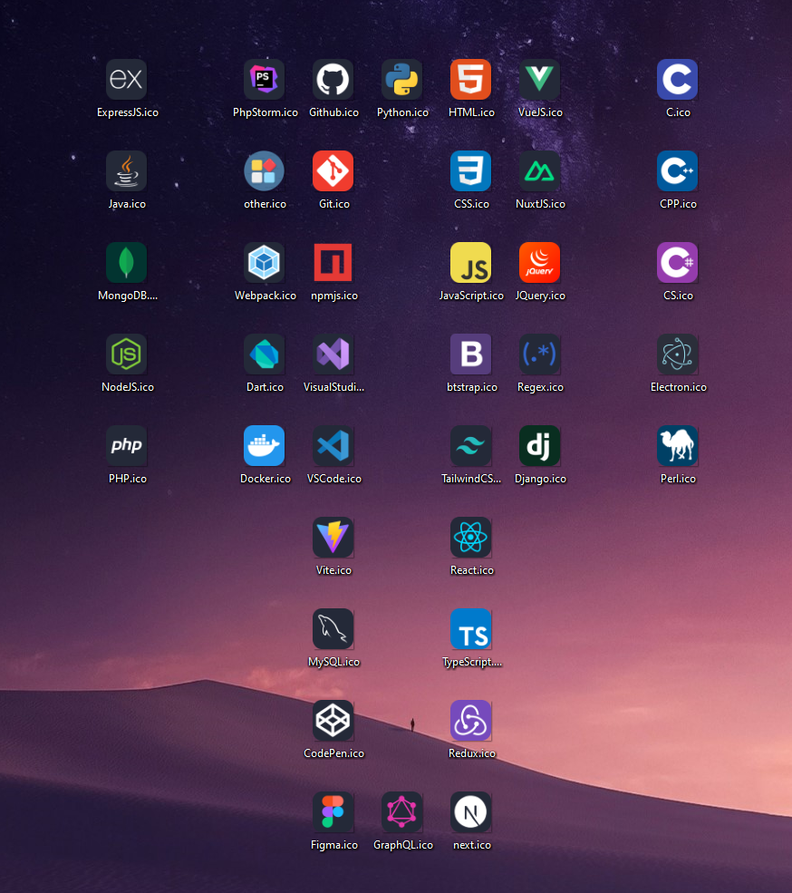
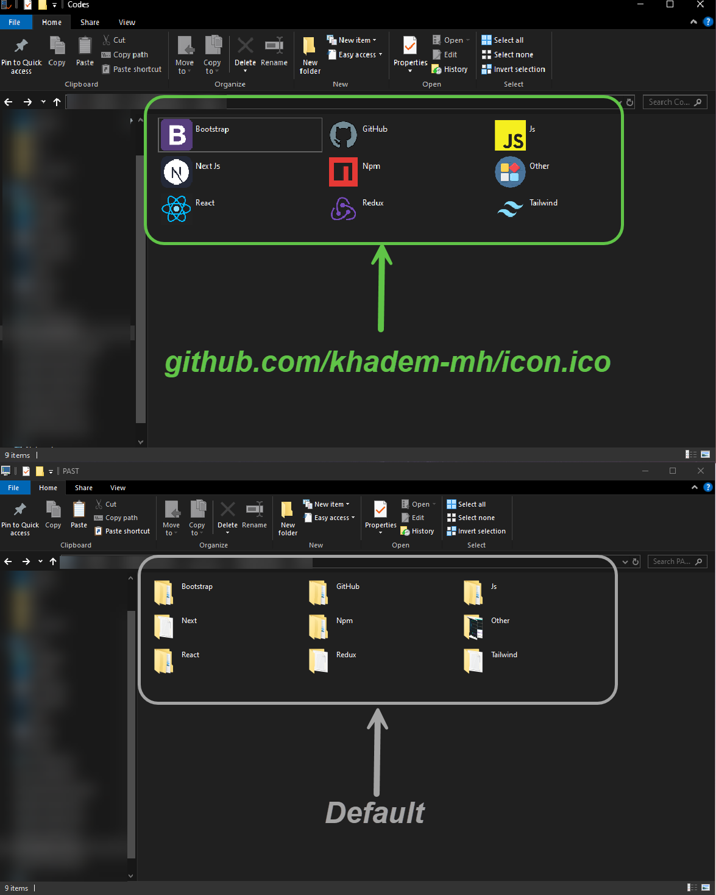

>> #### A developer's folder in any work field should look like this 👨‍💻 👇 
>>
>> #### It is much more attractive and better to use icons to quickly find our own folder

## And the complete list of all logos that you can download and enjoy 😃
 

 

## Which one is better? Well, it is clear that the picture above is better 😃 
 

 

___
>### Social Network
> 
> 
> 
> 
> 
> 
> 